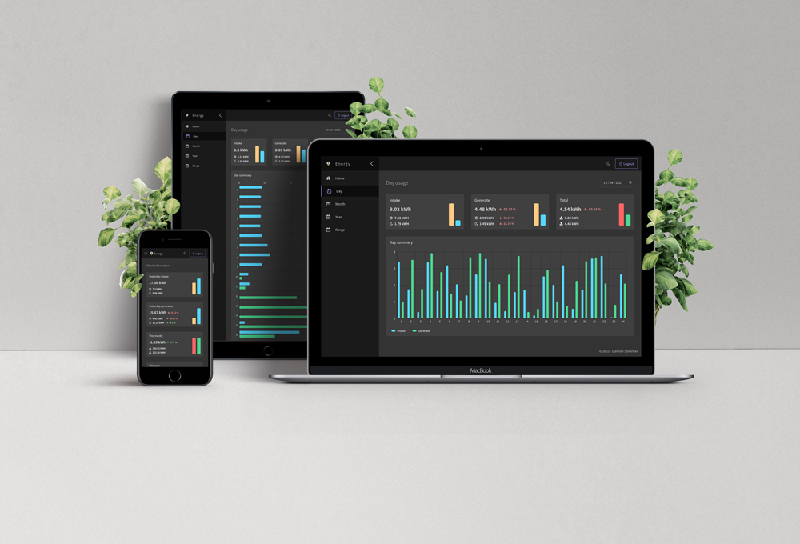

Tauron API
===========

Unofficial TAURON API allows getting information about power consumption and production in simple json format.

Installation
------------

Use [Composer](https://getcomposer.org/) to install the package:

```
composer install
```

Usage
-----

### Login

To get data from *Tauron eLicznik* pass login data is required. Login endpoint expects `POST` request with a `Content-Type` header set as `application/json`.  
The request body should be in a format:

```json
{
  "pointId": "----",
  "username": "---",
  "password": "---"
}
```

To login as test user: 
```json
{
  "pointId": "0",
  "username": "test",
  "password": "test"
}
```

After successfully login endpoint return **token** which is encrypted (`aes-128-cbc`) login data.  
Default encryption parameters are:

```yaml
ENCRYPT_ALGORITHM=aes-128-cbc
ENCRYPT_KEY=ab12vfsc521*zx
ENCRYPT_INIT_VECTOR=1234567812345678
```

The parameters may be changed in `.env` file.  
The token is used by other endpoints as an authorization API Key.

### Endpoints

Endpoint                                                    | Description                                                                                                                                       | Example
----------------------------------------------------------- | ------------------------------------------------------------------------------------------------------------------------------------------------- | -----------------------
`/days/{date}`                                              | Get total day usage and array with hours of the day usage. Expect date in `dd-mm-yyyy` format.                                                    | `/days/20-01-2021`
`/months/{data}`                                            | Get total month usage and array with days of the month usage. Expect date in `mm-yyyy` format.                                                    | `/months/01-2021`
`/years/{year}`                                             | Get total year usage and array with months of the year usage. Expect current year or earlier.                                                     | `/years/2021`
`/range?startDate={date}&endDate={date}`                    | Get total usage between start date and end date. Expect query string with dates in `mm-yyyy` format.                                              | `/range?startDate=01-2021&endDate=03-2021`
`/all`                                                      | Get total usage and array with years usage.                                                                                                       | `/all`
`/collection?days[]={date}&months[]={date}&years[]={year}`  | Get collection with specific set of data. Expect query string with dates and years. Each part of the query string may be duplicated or be omitted | `/collection?days[]=29-03-2021&days[]=28-03-2021&months[]=03-2021&years[]=2021`
`/login`                                                    | Expect login data sending in request body                                                                                                         | `/login`

Each of the endpoints requires headers with:

```http request
Authorization: [ token ]
Content-Type: application/json
```

### API Client and CORS

To allow an API Client getting data, set the Client app url in `.env` file:
```
###> nelmio/cors-bundle ###
CORS_ALLOW_ORIGIN='^https?://(localhost|127\.0\.0\.1)(:[0-9]+)?$'
###< nelmio/cors-bundle ###
```

### Tests

Running the tests is simple:

```
composer run-script test
```

Example
-----
Example Angular SPA app using this API: [tauron.es3d.pl](https://tauron.es3d.pl)




License
-------

All contents of this project are licensed under the MIT license.
